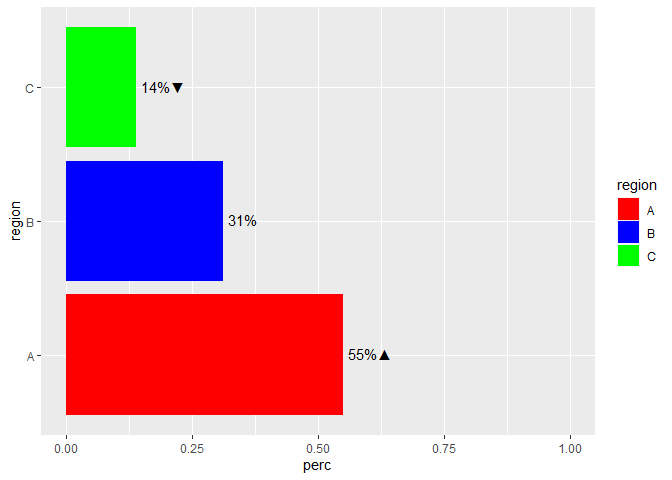

<!-- README.md is generated from README.Rmd. Please edit that file -->

# tidytests

<!-- badges: start -->

[](https://www.tidyverse.org/lifecycle/#stable)
<!-- badges: end -->

The goal of tidytests is to provide a tidy implementation of the output
from t-tests and proportional tests.

## Installation

You can install the development version from
[GitHub](https://github.com/) with:

``` r
# install.packages("remotes")
remotes::install_github("pstraforelli/tidytests")
```

## Example

The package’s functions follow an iterative process. First, use either
one of two functions, `pairwise_t_test()` and `pairwise_prop_test()`.
Both take a raw data frame as input, and the variables to be used for
testing.

### `pairwise_t_test()`

``` r
library(tidytests)

pairwise_t_test(iris, Sepal.Length, Species)
#> # A tibble: 3 × 9
#>   higher_group lower_group  p_value higher_mean lower_mean higher_sd lower_sd
#>   <fct>        <fct>          <dbl>       <dbl>      <dbl>     <dbl>    <dbl>
#> 1 versicolor   setosa      1.75e-15        5.94       5.01     0.516    0.352
#> 2 virginica    setosa      6.64e-32        6.59       5.01     0.636    0.352
#> 3 virginica    versicolor  2.77e- 9        6.59       5.94     0.636    0.516
#> # ℹ 2 more variables: higher_n <int>, lower_n <int>
```

### `pairwise_prop_test()`

``` r
set.seed(1) # For reproducibility

mydf <- data.frame(smokers = c(rbinom(100, 1, 0.8),
                               rbinom(70, 1, 0.6),
                               rbinom(50, 1, 0.3)),
                   region = c(rep("A", 100), rep("B", 70), rep("C", 50)))
test_df <- pairwise_prop_test(mydf, smokers, region)
test_df
#> # A tibble: 6 × 8
#>   smokers higher_group lower_group    p_value higher_percentage lower_percentage
#>     <int> <fct>        <fct>            <dbl>             <dbl>            <dbl>
#> 1       0 B            A           0.0268                 0.329            0.17 
#> 2       0 C            A           0.00000228             0.58             0.17 
#> 3       0 C            B           0.0213                 0.58             0.329
#> 4       1 A            B           0.0268                 0.83             0.671
#> 5       1 A            C           0.00000228             0.83             0.42 
#> 6       1 B            C           0.0213                 0.671            0.42 
#> # ℹ 2 more variables: higher_n <int>, lower_n <int>

# Comparing each subgroup vs rest of the sample:
test_df2 <- pairwise_prop_test(mydf, smokers, region, vs_rest = TRUE)
test_df2
#> # A tibble: 6 × 8
#>   smokers higher_group lower_group    p_value higher_percentage lower_percentage
#>     <int> <fct>        <fct>            <dbl>             <dbl>            <dbl>
#> 1       0 Other        A           0.0000521              0.433            0.17 
#> 2       0 B            Other       0.865                  0.329            0.307
#> 3       0 C            Other       0.00000880             0.58             0.235
#> 4       1 A            Other       0.0000521              0.83             0.567
#> 5       1 Other        B           0.865                  0.693            0.671
#> 6       1 Other        C           0.00000880             0.765            0.42 
#> # ℹ 2 more variables: higher_n <int>, lower_n <int>
```

Then filter out comparisons that you do not want to show if they do not
pass a threshold of your choice (such as a p-value of 0.05).

``` r
library(dplyr, warn.conflicts = FALSE)
test_df_sig <- test_df |> 
  filter(p_value < 0.05, smokers == 1) |> # Only interested in the % among smokers
  select(higher_group, lower_group) # Don't need the rest of the output for the following steps

test_df_sig2 <- test_df2 |> 
  filter(p_value < 0.05, smokers == 1) |> # Only interested in the % among smokers
  select(higher_group, lower_group) # Don't need the rest of the output for the following steps
```

### `prep_sigmark()`

Use `prep_sigmark()` to combine the summary results of your data frame
to the output of `pairwise_*_test()`.

``` r
# Creating summary output
mydf_summ <- mydf |> 
  count(smokers, region) |>
  filter(smokers == 1) |>
  mutate(perc = n / sum(n))
mydf_summ
#>   smokers region  n      perc
#> 1       1      A 83 0.5496689
#> 2       1      B 47 0.3112583
#> 3       1      C 21 0.1390728

# Creating colour vector for upcoming chart
colour_vec <- c("red", "blue", "green")
names(colour_vec) <- LETTERS[1:3]

mydf_prep <- prep_sigmark(mydf_summ, test_df_sig, region, perc, colour_vec, percent = TRUE, vs_rest = FALSE)
mydf_prep
#> # A tibble: 3 × 3
#>   region  perc labels                                                           
#>   <fct>  <dbl> <chr>                                                            
#> 1 A      0.550 55%<span style='color:blue'>&#9650;</span><span style='color:gre…
#> 2 B      0.311 31%<span style='color:green'>&#9650;</span>                      
#> 3 C      0.139 14%

# With comparisons to rest of sample:
mydf_prep2 <- prep_sigmark(mydf_summ, test_df_sig2, region, perc, colour_vec, percent = TRUE, vs_rest = TRUE)
mydf_prep2
#>   smokers region  n      perc         name
#> 1       1      A 83 0.5496689 higher_group
#> 2       1      B 47 0.3112583         <NA>
#> 3       1      C 21 0.1390728  lower_group
#>                                        labels
#> 1 55%<span style='color:black'>&#9650;</span>
#> 2                                         31%
#> 3 14%<span style='color:black'>&#9660;</span>
```

### `geom_sigmark()`

Use `geom_sigmark()` as a geom object for your ggplot2 chart.

``` r
library(ggplot2)
ggplot(mydf_prep, aes(x = perc, y = region, label = labels, fill = region)) +
  geom_col() +
  geom_sigmark("fill", colour_vec, hjust = 0) +
  xlim(c(0, 1))
```


``` r

# Comparing each subgroup to rest of sample:
ggplot(mydf_prep2, aes(x = perc, y = region, label = labels, fill = region)) +
  geom_col() +
  geom_sigmark(hjust = 0) +
  scale_fill_manual(values = colour_vec) + 
  xlim(c(0, 1))
```



Note that you will see warnings about the encoding of the significance
markers. Those can be ignored.
